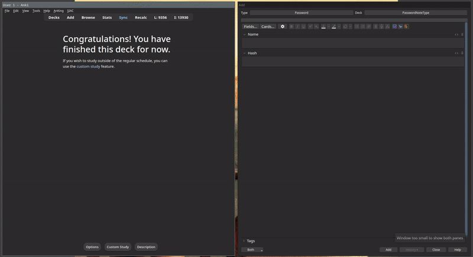

# PasswordNoteType
Many people store their passwords in plain text, whether in spreadsheets, text files, or even digital note-taking apps. This practice is incredibly insecure; if someone gains access to your notes, they can easily view all your passwords. Plain text storage leaves you vulnerable to data breaches, hacking, and unauthorized access.

To mitigate these risks, it's crucial to implement secure password management practices. One effective method is to hash your passwords before storing them. Hashing transforms your password into a fixed-size string of characters, which is not easily reversible, ensuring that even if someone accesses your notes, they cannot easily obtain your actual passwords.

